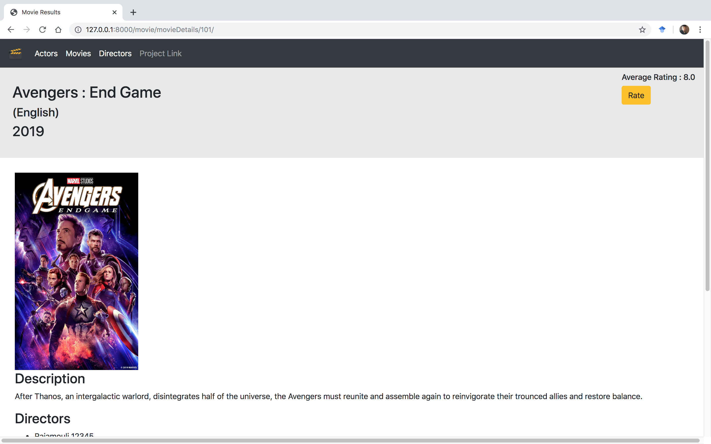
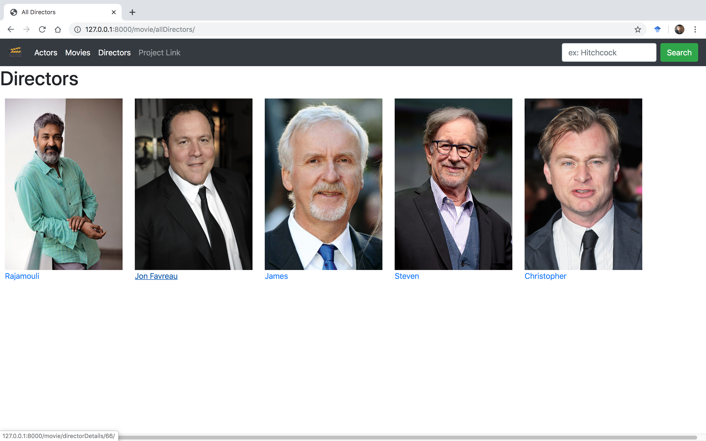
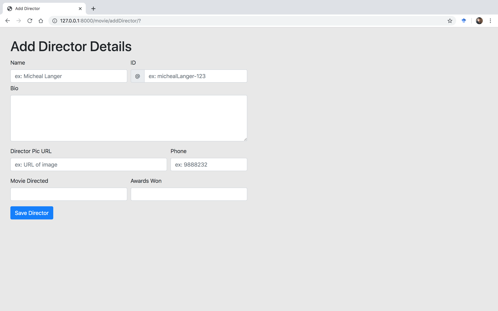
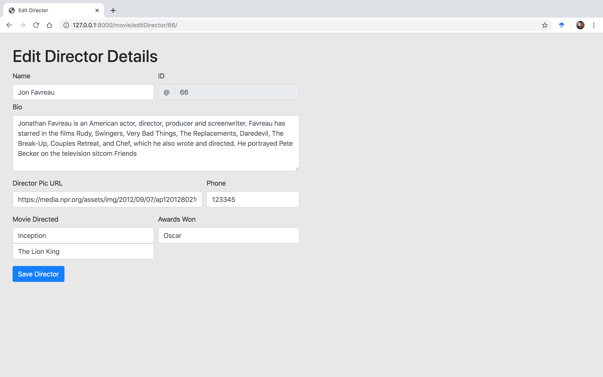

# Movie Database

* A mini-project, web-based database application made for maintaining information about movies, actors and directors.

* The database is implemented MySQL, which implements Transaction and Concurrency control. 

* The application layer is written in Python and uses a web-framework - Django.

Screenshots

